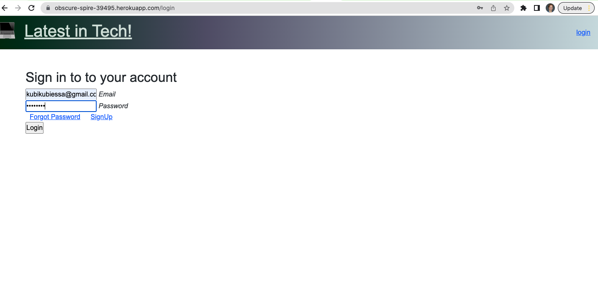

# Tech-Blog
This project entails a CMS-style blog site similar to a Wordpress site, where developers can publish their blog posts and comment on other developers’ posts as well. 
 

  ## Table of Contents <!-- omit in toc -->
- [Tech-Blog](#tech-blog)
  - [Description](#description)
  - [Usage](#usage)
  - [Contribution](#contribution)
  - [Mockup](#mockup)
  - [Credits](#credits)
  
## Description
This application is a blog whith which users can send posts, make comments on posts.  It is platform for users to come together to share and comment about the latest in tech. 

This is a full-stack application using the following technologies:
- Node.js and Express.js to create a RESTful API
- Handlebars.js as the template engine.
- MySQL and the Sequelize ORM for the database.
- Passport for authentication
- Heroku
  
## Usage 
The user can
- sign up for their profile
- log in and log out
- create new posts and delete posts
- comment on other posts
 
## Contribution

If you have an idea to improve this app, fork the repo, create your branch, commit changes, push your contribution to your branch, and create a pull request. 

 

 ## Mockup 

Main page is the login screen. If a user doesn't have an account, they can click on either sign up links to be redirected to that page.

At the signup page, users are asked to input three fields of information that will pertain to their new  account.

Upon creating a valid new account, users are redirected to their dashboard. Here they can access numerous features of the site.

Screen for creating a blog:

 
Blogs you create will also populate in your dashboard so you can keep track of your latest blogs: 

 

 Users are able to comment on other users' blogs as well

The app will track the number of comments on a given blogs, and blogs show up on the homepage when logged in.

Users can edit their on blogs: 

When a user signs out, they will be redirected to the login screen where they can choose to log back in and continue blogging!  

## Credits

This repo was created by Heidrun Kubiessa (kubiKubiessa).

Contact Kubi:

[Heidrun's GitHub](https://github.com/kubikubiessa)

[Email](kubikubiessa@gmail.com)

[LinkedIn](https://www.linkedin.com/in/heidrun-kubiessa-ph-d-98110324a/)